# AI Advent Day 10: стратегии управления контекстом

Ниже простое, но подробное описание того, что сделано, как это работает и какая получилась архитектура.

## Что сделано

Реализовано демо для задания Day 10: агент умеет работать с разными стратегиями управления контекстом и наглядно сравнивать их на одном сценарии.

Главная идея:

> Один и тот же диалог прогоняется через разные стратегии.
> Каждая стратегия по-своему решает, что отправить в модель.
> UI показывает: какой prompt ушел в модель, какие детали сохранились, какие потерялись, сколько ушло токенов и каким получился ответ.

Всего в демо 7 стратегий:

| # | Стратегия | Простыми словами |
|---:|---|---|
| 1 | Sliding Window | Берем только последние N сообщений |
| 2 | Sticky Facts | Храним важные факты отдельно как key-value |
| 3 | Branching | Делаем ветки диалога от checkpoint |
| 4 | Profile Memory + History Summaries | Старая сильная память: профиль, факты, выводы, summaries |
| 5 | Tokenization and Cut | Обрезаем историю по token budget |
| 6 | Context Leveling | Раскладываем контекст по уровням: цель, ограничения, решения |
| 7 | Conversation Recreation | Пересобираем чистый prompt из structured state |

## Общая схема

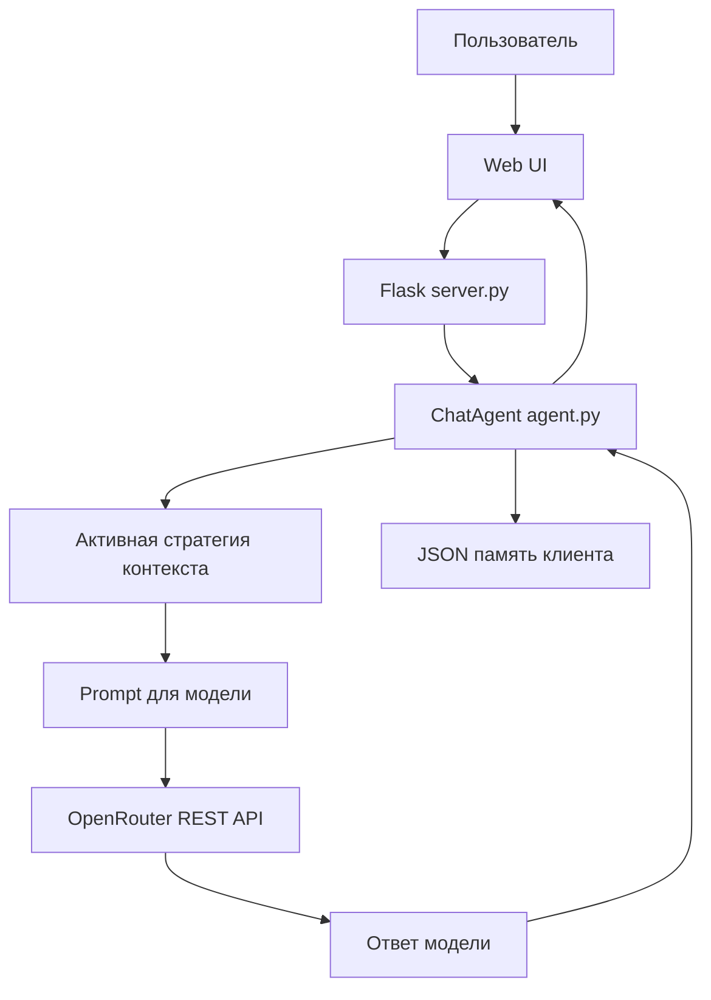

UI сам не ходит в OpenRouter. Ключ остается только на backend. Backend собирает prompt, отправляет REST-запрос через `httpx.post`, получает ответ и сохраняет состояние.

## Главная архитектурная идея

Раньше у агента была одна логика памяти. Теперь есть переключатель стратегий.

В памяти клиента есть общий блок:

```text
memory
├── active_strategy
├── demo_progress
├── demo_run
├── comparison_results
├── current_chat
├── archived_chats
└── strategies
    ├── sliding_window
    ├── sticky_facts
    ├── branching
    ├── profile_summaries
    ├── token_cut
    ├── context_leveling
    └── conversation_recreation
```

Ключевой момент:

> У каждой стратегии свое изолированное состояние.
> Когда активна одна стратегия, другие не подмешиваются в prompt.

## Как работает один запрос

Когда пользователь пишет сообщение:

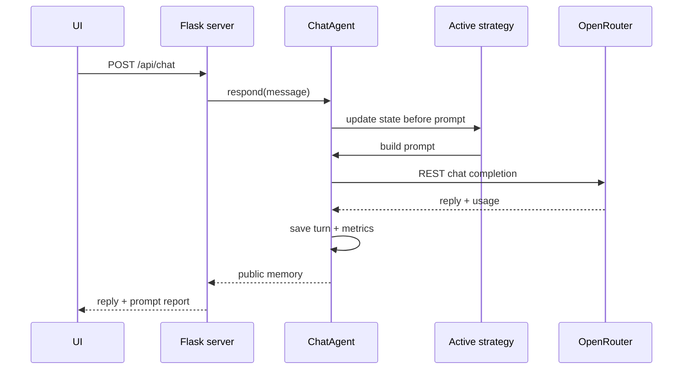

Важная часть: стратегия решает, что именно попадет в prompt.

## Стратегии

### 1. Sliding Window

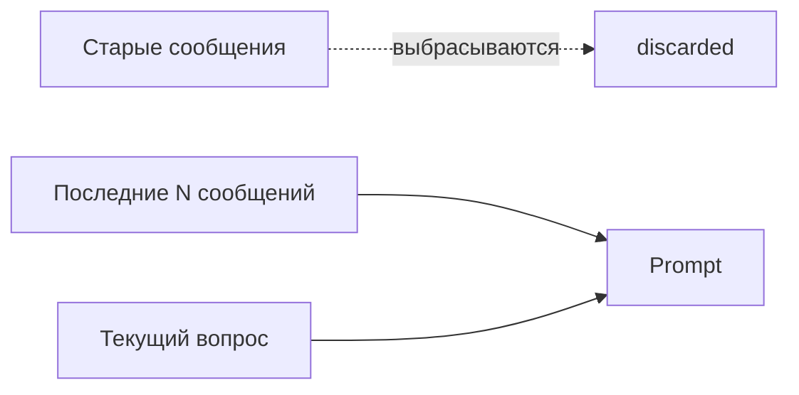

Простыми словами: агент помнит только последние 4 сообщения. Все более старое отбрасывается.

Плюс: дешево и просто.
Минус: ранние важные требования легко теряются.

В коде дополнительно поправлено: Sliding Window режется не только при сборке prompt, но и при загрузке/нормализации состояния.

### 2. Sticky Facts

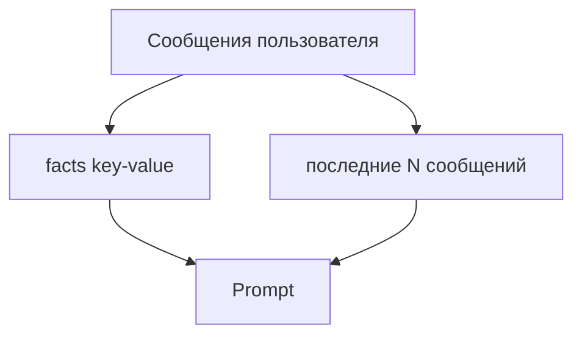

Простыми словами: важные данные выносятся в отдельный словарь `facts`: цель, deadline, ограничения, роли и так далее.

Prompt состоит из:

```text
system instructions
+ sticky facts JSON
+ последние сообщения
+ текущий вопрос
```

Это помогает не потерять ранние требования.

### 3. Branching

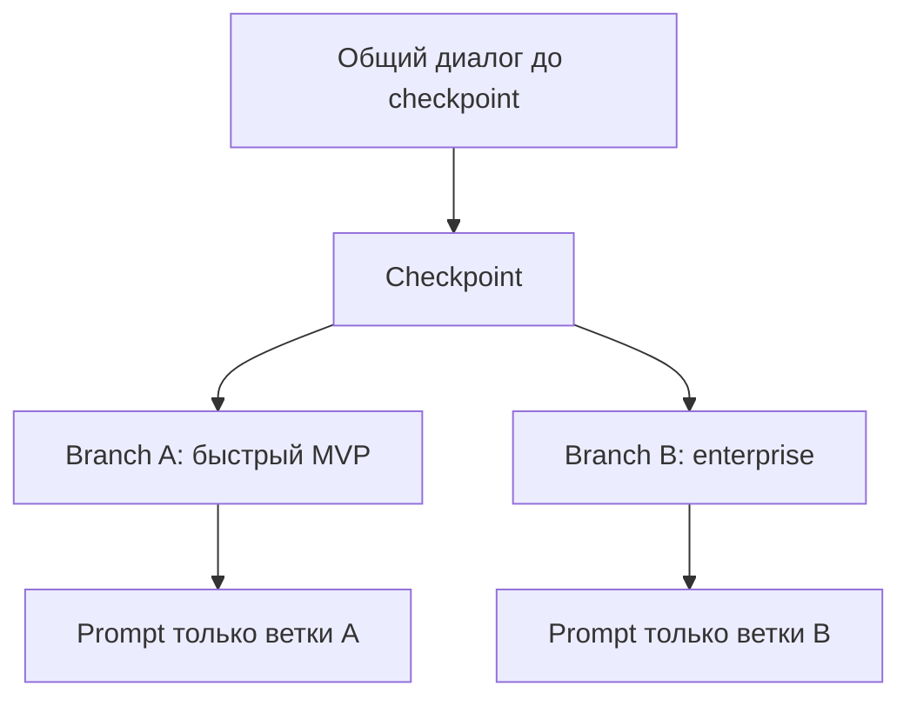

Простыми словами: до определенного момента диалог общий. Потом создаются две ветки. Ветка A и ветка B продолжаются независимо.

Это нужно, чтобы сравнивать разные варианты решения и не смешивать их.

| Ветка | Что в ней |
|---|---|
| Branch A | быстрый MVP за 3 недели |
| Branch B | enterprise-вариант для школ/кружков |

В prompt активной ветки не попадают сообщения другой ветки.

### 4. Profile Memory + History Summaries

Это сохраненная старая сильная реализация, но теперь она стала отдельной стратегией.

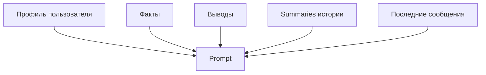

Простыми словами: агент хранит профиль пользователя, факты, предположения, summary текущего чата и summaries прошлых чатов.

Важно: эта стратегия делает дополнительный LLM-вызов для обновления памяти. Метрики учитывают не только основной ответ, но и этот дополнительный memory-update call.

### 5. Tokenization and Cut

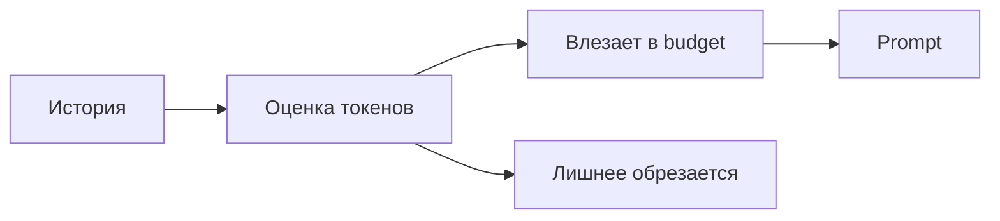

Простыми словами: история режется не по количеству сообщений, а по примерному token budget.

Это честнее, потому что одно длинное сообщение может быть тяжелее пяти коротких.
В демо поздний enterprise-блок специально длинный: в prompt preview видно, как oversized history message получает маркер `[truncated by token budget]`.

### 6. Context Leveling

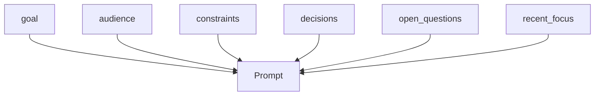

Простыми словами: агент раскладывает контекст по полкам: цель, аудитория, ограничения, решения, открытые вопросы и текущий фокус.

В prompt отправляется не вся сырая история, а структурная карта задачи. Это удобно для сложных ТЗ, где важна стабильность.

### 7. Conversation Recreation

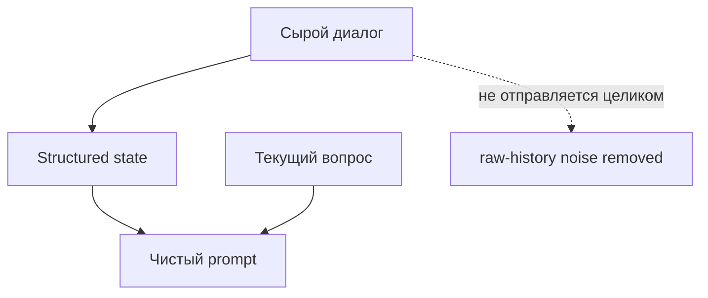

Простыми словами: каждый раз prompt пересобирается заново из структурированного состояния и текущего вопроса.

Сырая история не отправляется. Это снижает шум и делает prompt более чистым.

## Демо-сценарий

Сценарий лежит в `llm_demo/demo_script.py`.

Он состоит из 12 сообщений. Мы собираем ТЗ для продукта: семейный задачник.

В ранних сообщениях специально есть важные детали:

| Деталь | Зачем нужна |
|---|---|
| Цель продукта | должна попасть в итоговое ТЗ |
| Аудитория | родители и дети 7-12 |
| Deadline | MVP за 3 недели |
| Offline-first | архитектурное ограничение |
| Без ML | ограничение бюджета |
| Роли пользователей | родитель, ребенок, админ семьи |
| MVP | списки дел, назначение задач, дедлайны, напоминания |
| Запреты | без чата, оплаты, публичных профилей |

Потом идут шум и уточнения. Финальный вопрос просит собрать итоговое ТЗ и не потерять ранние ограничения.

## Как работает Run All

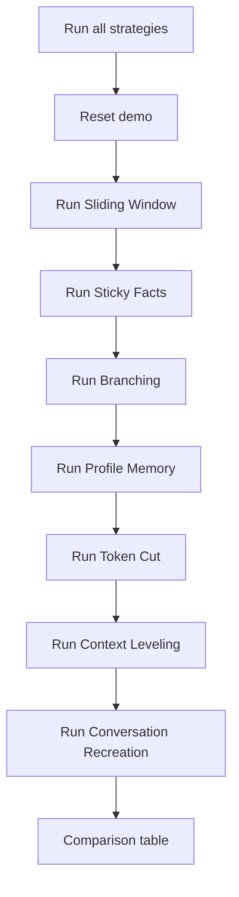

Для каждой стратегии прогоняется один и тот же сценарий. После этого UI показывает таблицу сравнения.

Сейчас `Run active`, `Run all` и `Continue` работают в live-step режиме: браузер вызывает backend по одному шагу сценария и обновляет UI после каждого paid OpenRouter call.

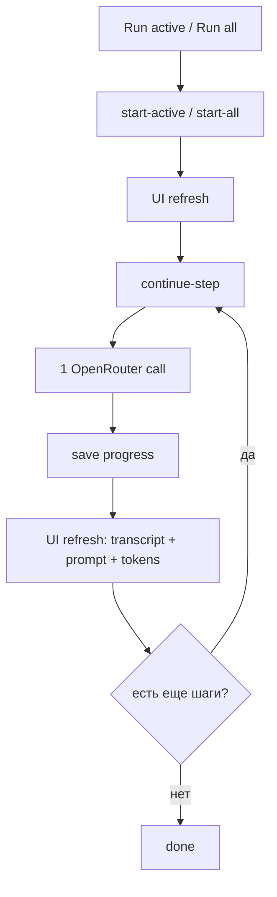

Это выглядит так, будто пользователь сам пошагово ведет демо: после каждого шага обновляются transcript, prompt preview, metrics, timeline и comparison table.

## Что видно в UI

| Блок UI | Что показывает |
|---|---|
| Strategy tabs | выбор одной активной стратегии |
| Reset demo | сброс сценария |
| Next step | ручной пошаговый прогон |
| Run active | прогнать только выбранную стратегию |
| Run all | прогнать все стратегии |
| Continue | продолжить упавший/остановленный прогон без повтора оплаченных шагов |
| Stop | остановить длинный прогон |
| Timeline | 12 шагов сценария |
| Transcript | сообщения выбранной стратегии |
| Context sent to model | какие блоки реально ушли в модель |
| Prompt preview | полный preview prompt |
| Kept / Lost details | какие требования сохранились/потерялись |
| State | внутреннее состояние стратегии |
| Comparison | итоговая таблица сравнения |

## Prompt Inspector

Это один из самых важных блоков.

Он показывает:

```text
context blocks
estimated prompt tokens
actual prompt tokens
actual total tokens
included messages
discarded messages
kept details
lost details
prompt preview
```

То есть можно не просто сказать "агент забыл", а показать почему:

> Вот prompt. В нем нет early constraints. Поэтому ответ их потерял.

## Comparison Table

После `Run all` появляется таблица:

| Колонка | Что значит |
|---|---|
| Strategy | стратегия |
| Score | сколько важных деталей сохранилось |
| Tokens | фактические и оценочные токены |
| Cost/time | стоимость и время |
| Lost details | какие детали потерялись |
| Final answer | preview итогового ответа |

Для `Branching` таблица показывает финалы обеих веток отдельно: `Branch A` и `Branch B`.

Это закрывает критерии задания:

| Критерий | Где видно |
|---|---|
| качество ответа | final answer + score |
| стабильность | kept/lost details |
| расход токенов | tokens |
| удобство | UX note / UI поведение |
| сравнение стратегий | comparison table |

## Backend API

Основные endpoints:

| Method | Endpoint | Назначение |
|---|---|---|
| `POST` | `/api/context/strategy` | выбрать стратегию |
| `POST` | `/api/context/checkpoint` | сохранить checkpoint |
| `POST` | `/api/context/branches` | создать branch A/B |
| `POST` | `/api/context/branch` | переключить ветку |
| `POST` | `/api/demo/reset` | сбросить демо |
| `POST` | `/api/demo/next` | выполнить следующий шаг |
| `POST` | `/api/demo/start-active` | начать live `Run active` |
| `POST` | `/api/demo/start-all` | начать live `Run all` |
| `POST` | `/api/demo/continue-step` | выполнить ровно один шаг live-прогона |
| `POST` | `/api/demo/continue` | продолжить старый совместимый full resume |
| `POST` | `/api/demo/run-active` | совместимый full-прогон активной стратегии |
| `POST` | `/api/demo/run-all` | совместимый full-прогон всех стратегий |
| `POST` | `/api/demo/stop` | остановить длинный прогон |

## Как устроено хранение

Память хранится в JSON-файле клиента:

```text
llm_demo/data/clients/<client_id>.json
```

Упрощенно:

```json
{
  "active_strategy": "sticky_facts",
  "demo_progress": 5,
  "demo_run": {
    "mode": "all",
    "strategy_id": "sticky_facts",
    "strategy_index": 1,
    "progress": 7,
    "results": [],
    "error": ""
  },
  "comparison_results": [],
  "strategies": {
    "sliding_window": {},
    "sticky_facts": {
      "facts": {},
      "messages": []
    },
    "branching": {
      "checkpoint": [],
      "active_branch": "branch_a",
      "branches": {}
    }
  }
}
```

Это удобно для демо: можно переключаться между стратегиями и видеть, что состояние у каждой свое. Если OpenRouter падает посреди `Run active` или `Run all`, `demo_run` хранит точку продолжения, чтобы не повторять уже оплаченные шаги.

## Модель OpenRouter

Для демо выбрана реальная OpenRouter-модель:

```text
meta-llama/llama-3-8b-instruct
```

Она дешевле и имеет context window около 8k, поэтому context pressure видно лучше, чем на больших long-context моделях. Для продового качества ответов можно вернуть более сильную модель, но для демонстрации стратегий контекста важнее, чтобы потеря деталей была заметна.

Также ограничен output:

```text
max_tokens = 700
```

Так ответы не раздуваются и демо меньше тратит токены.

## Что было дополнительно поправлено после ревью

| Исправление | Почему важно |
|---|---|
| `Stop run` теперь серверный | раньше браузер мог оборвать запрос, но backend продолжил бы делать LLM calls |
| `Continue` после ошибки | не повторяет уже оплаченные шаги |
| Live-step выполнение | после каждого шага обновляются UI и метрики |
| Sliding Window режется при загрузке state | иначе старый JSON мог хранить больше N сообщений |
| Branching восстанавливает пустой branch state | защита от битой памяти |
| Profile Memory считает auxiliary calls | честное сравнение токенов/стоимости |
| Некорректный `version` в памяти не ломает загрузку | устойчивость к старым/битым JSON |
| OpenRouter provider fallback включен | один проблемный provider не валит весь demo |

## Запуск демо

```powershell
cd D:\aiadvent\llm_demo
$env:OPENROUTER_API_KEY="sk-or-..."
$env:HOST="127.0.0.1"
$env:PORT="5050"
.\.venv\Scripts\python.exe server.py
```

Открыть:

```text
http://127.0.0.1:5050
```

## Проверки

Были запущены:

| Проверка | Результат |
|---|---|
| `python -m py_compile llm_demo/server.py llm_demo/llm_client.py llm_demo/agent.py` | OK |
| `python -m unittest llm_demo.test_agent_persistence` | OK, 16 tests |
| `git diff --check` | OK |
| HTTP smoke для UI/API | OK |
| `ast-index update` | OK |

## Самая короткая суть

Если объяснять совсем просто:

> Я сделал агенту 7 разных способов "помнить контекст".
> Каждый способ изолирован и выбирается через UI.
> Один и тот же сценарий ТЗ можно прогнать через все стратегии и увидеть, какая лучше сохраняет важные детали, сколько тратит токенов и какой prompt реально отправляет в модель.
> Для демонстрации есть timeline, prompt inspector, kept/lost details и comparison table.
